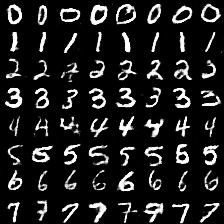

# dl_udacity_ex
https://github.com/udacity/deep-learning

self-training:

# test for 'github with mathJax' extension in chrome brower
[mathJax for chrome](https://chrome.google.com/webstore/detail/github-with-mathjax/ioemnmodlmafdkllaclgeombjnmnbima)

$x_j$

# test for display image in github .md file

# replay the results about several gan model in ex4
- [info-gan](https://github.com/SpinachR/dl_udacity_ex/tree/master/ex4_gan_model/improved_gan)
- [conditional-gan](https://github.com/SpinachR/dl_udacity_ex/tree/master/ex4_gan_model)
- [improved-gan](https://github.com/SpinachR/dl_udacity_ex/tree/master/ex4_gan_model/improved_gan)
