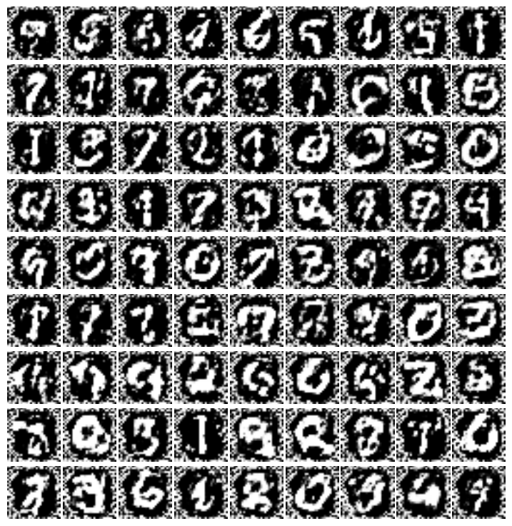
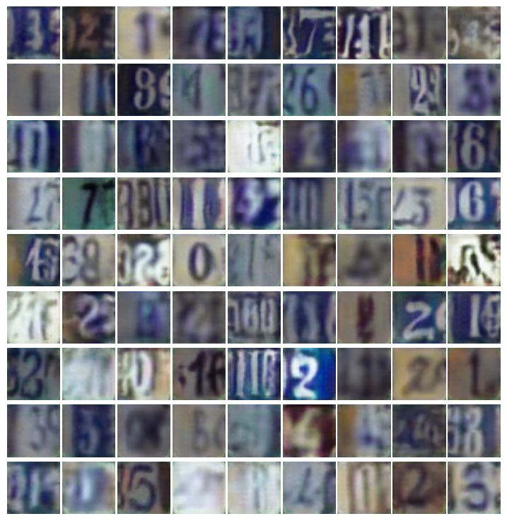
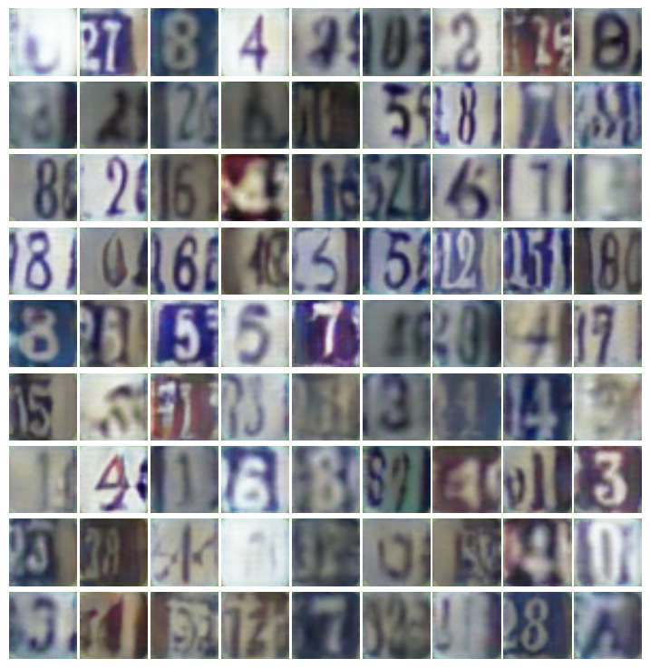
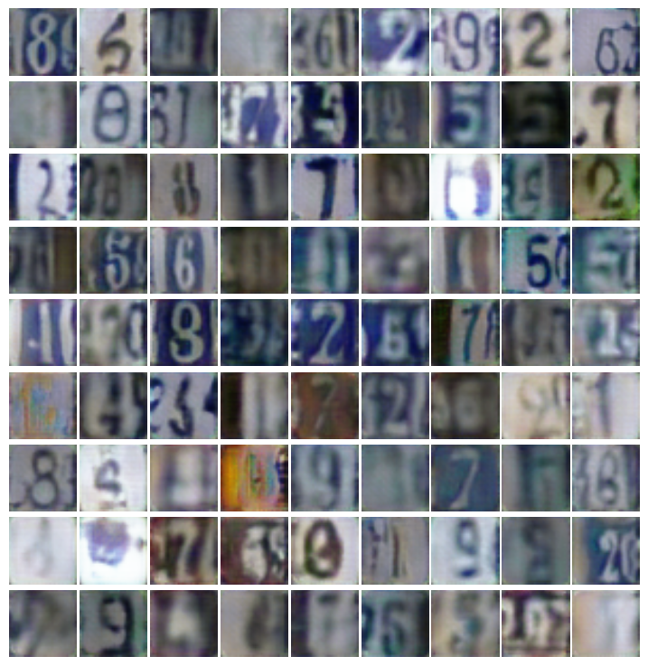

only one hidden layer with 128 nodes

# 1.Original Bidirectional_gan or ALI

## Without batchNorm and using uniform distribution for z [64 dim]

Generated Examples:

Loss summary (d_loss and g_loss):

___
## With batchNorm and using uniform distribution for z [64 dim]
Generated Examples:

Loss summary (d_loss and g_loss):

___
## Without batchNorm and using uniform distribution for z [100 dim]
Generated Examples:

Loss summary (d_loss and g_loss):

___
## With batchNorm and using uniform distribution for z [100 dim]

Generated Examples:

Loss summary (d_loss and g_loss):

___

# 2.ALI model (The same architecture with the paper)

The generated samples of SVHN datasets:

