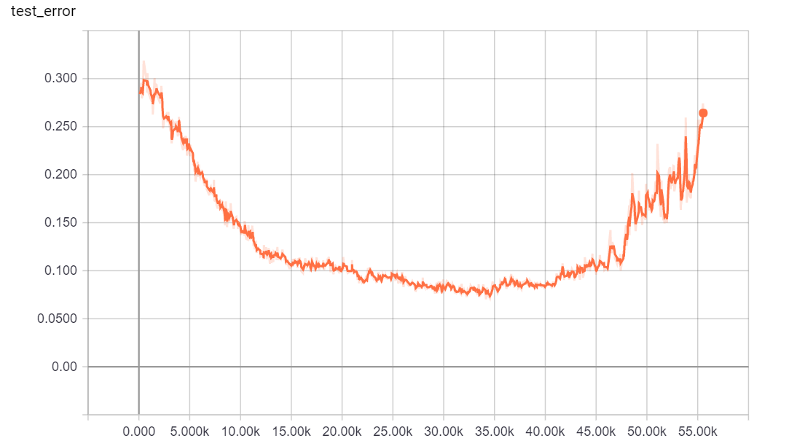

# generated images
18000 steps

40000 steps

We can find that at the end of training stage, the Generator was collapsed.

# summary results

Here we use only 100 labeled samples, each class has 10 random samples
labeled data can be correctly classified after a few updates.

We use feature mapping for the generator. 
The loss is smoothing in the middle, but it seems overfitting during the end of training

The test_error was decreased gradually as training goes by, but during the stage, the training error was almost zero.
So what makes the test_error goes down?
However, in the end, the test_error increases, which means it overfits.
The best result in this training was **93%** (accuracy)
