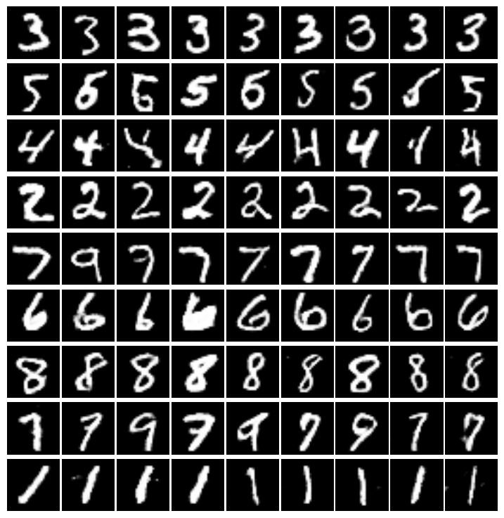

'''
python train_infogan.py
'''
- for continuous variables, please use uniform distribution with [0, 1].
- Q_loss: employ cross-entropy
- update Q network, please update all the variables in Q and G. If you share Q and D, please update all the variables
- for batch_size, 32 is enough. (128 is not good)

## Architecture of info_gan

## Some generated nmist images by info_gan

